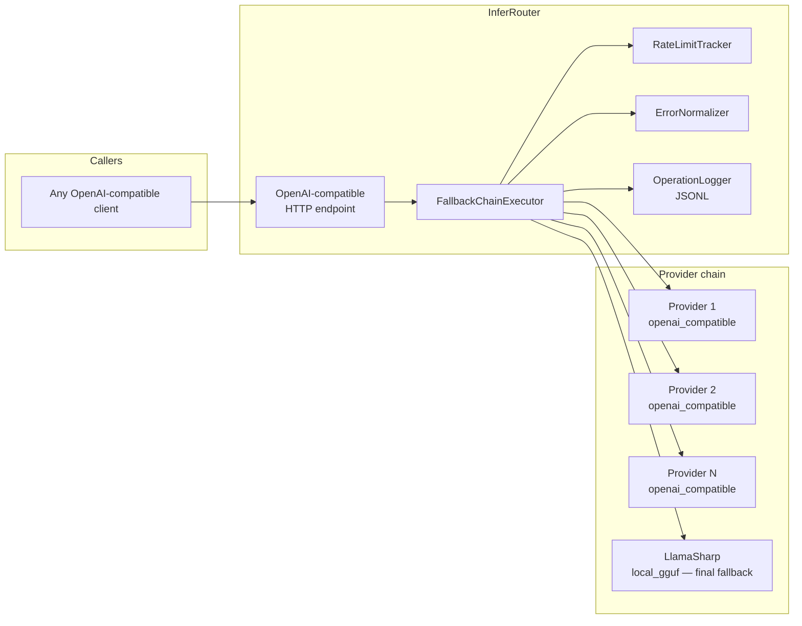

# InferRouter

A self-hosted, provider-agnostic LLM inference proxy. Exposes a single OpenAI-compatible HTTP endpoint and internally routes requests through a fully configurable fallback chain — from any cloud or local HTTP provider down to a local GGUF model — with built-in rate limit tracking and structured operation logging.

---

## Why This Exists

Managing multiple LLM providers across projects means duplicated API key handling, scattered fallback logic, and tight coupling to specific provider SDKs. InferRouter centralizes all of that into a single sidecar service:

- **One API key store** — secrets live in one place, mounted securely via Docker Secrets
- **Transparent fallback** — if a provider hits its rate limit or fails, the caller never notices
- **Provider flexibility** — add, remove, or reorder providers via config with no code changes
- **Normalized error handling** — provider-specific HTTP status codes are mapped to a consistent internal taxonomy
- **Operation log** — every inference call is recorded in a provider-agnostic structured log

Any application that speaks the OpenAI chat completions API can use InferRouter as a drop-in inference backend.

---

## Architecture Overview



**Fallback chain:** configurable ordered list of OpenAI-compatible providers, with LlamaSharp as the guaranteed final fallback. The chain is defined entirely in configuration — no code changes are required to add, remove, or reorder providers.

---

## Key Design Decisions

- **Single outward-facing endpoint** — callers use one URL regardless of which provider actually handles the request. Provider changes are invisible to callers.

- **Provider-agnostic operation log** — the log records *events*, not providers. The provider is an attribute. The log schema never changes when providers are added or swapped. → ADR-001

- **Rate limit tracking in-memory** — provider quotas are tracked locally with UTC midnight resets. No external store is required. A `429` response from a provider triggers an immediate fallback and updates the local counter. → ADR-002

- **Config-driven provider chain** — providers are defined in `appsettings.json` with type, base URL, model, fallback order, and error mappings. Any OpenAI-compatible HTTP endpoint can be added without code changes. → ADR-003

- **LlamaSharp as library, not sidecar** — LlamaSharp runs in-process. It does not expose an HTTP endpoint. This avoids the overhead of a second container while keeping it behind the same `ILlmProvider` interface as all other providers. → ADR-004

- **Docker Secrets for API keys** — keys are mounted at `/run/secrets/` and never appear in environment variables or config files. The `secrets/` directory is git-ignored; `secrets.example/` documents the expected layout. → ADR-005

- **Normalized error handling** — each provider config includes an `ErrorMappings` block that translates provider-specific HTTP status codes and error types to a consistent internal error category (`rate_limit`, `auth_error`, `model_unavailable`, `server_error`). This allows the fallback logic to make consistent decisions regardless of provider. → ADR-006

---

## Provider Configuration

Providers are defined as an ordered list. The chain is tried top-to-bottom. LlamaSharp (`local_gguf`) must be last.

```json
{
  "Providers": [
    {
      "Name": "provider-a",
      "Type": "openai_compatible",
      "BaseUrl": "https://api.provider-a.com/v1",
      "Model": "model-name",
      "DailyRequestLimit": 1000,
      "RequestsPerMinute": 30,
      "ErrorMappings": [
        { "HttpStatus": 429, "ErrorCode": "rate_limit_exceeded", "InternalCategory": "RateLimit" },
        { "HttpStatus": 401, "InternalCategory": "AuthError" },
        { "HttpStatus": 503, "InternalCategory": "ServerError" }
      ]
    },
    {
      "Name": "provider-b",
      "Type": "openai_compatible",
      "BaseUrl": "https://api.provider-b.com/v1",
      "Model": "model-name",
      "DailyRequestLimit": 500,
      "RequestsPerMinute": 10,
      "ErrorMappings": [
        { "HttpStatus": 429, "InternalCategory": "RateLimit" },
        { "HttpStatus": 400, "ErrorCode": "quota_exceeded", "InternalCategory": "RateLimit" },
        { "HttpStatus": 401, "InternalCategory": "AuthError" }
      ]
    },
    {
      "Name": "local",
      "Type": "local_gguf",
      "ModelPath": "/models/model.gguf"
    }
  ]
}
```

The `ErrorMappings` block is per-provider. An `HttpStatus` match is required; `ErrorCode` is an optional additional filter on the provider's error response body. `InternalCategory` drives fallback behavior:

| InternalCategory | Fallback triggered |
|---|---|
| `RateLimit` | Yes |
| `ModelUnavailable` | Yes |
| `ServerError` | Yes (after retry) |
| `AuthError` | No — logged as fatal, no fallback |

---

## Operation Log

Every inference call produces one or more JSONL entries. The schema is provider-agnostic.

**Successful call:**
```json
{"ts":"2026-05-25T10:00:00Z","request_id":"uuid","event":"infer_completed","provider":"provider-a","model":"model-name","prompt_tokens":120,"completion_tokens":340,"latency_ms":310,"fallback":false,"status":"ok"}
```

**Fallback triggered:**
```json
{"ts":"2026-05-25T10:00:05Z","request_id":"uuid","event":"infer_fallback","from_provider":"provider-a","to_provider":"provider-b","reason":"rate_limit"}
{"ts":"2026-05-25T10:00:06Z","request_id":"uuid","event":"infer_completed","provider":"provider-b","model":"model-name","prompt_tokens":120,"completion_tokens":340,"latency_ms":890,"fallback":true,"status":"ok"}
```

**Event types:**

| Event | Description |
|---|---|
| `infer_started` | Request received by the router |
| `infer_completed` | Successful response returned |
| `infer_fallback` | Provider switch occurred |
| `infer_failed` | All providers exhausted or errored |
| `rate_limit_hit` | Local quota exceeded for a provider |

---

## Secret Management

API keys are never stored in config files or environment variables. They are mounted as Docker Secrets:

```
secrets/                  ← git-ignored, lives on the host only
    groq_api_key.txt
    gemini_api_key.txt

secrets.example/          ← committed to the repo, documents expected layout
    groq_api_key.txt          ← contains placeholder text
    gemini_api_key.txt
```

```yaml
# docker/docker-compose.yml (excerpt)
services:
  inferrouter:
    build:
      context: ..
      dockerfile: Dockerfile
    ports:
      - "5100:8080"
    secrets:
      - groq_api_key
      - gemini_api_key
    volumes:
      - type: bind
        source: ../models
        target: /models
        read_only: true
      - type: bind
        source: ../logs
        target: /var/log/inferrouter

secrets:
  groq_api_key:
    file: ../secrets/groq_api_key.txt
  gemini_api_key:
    file: ../secrets/gemini_api_key.txt
```

Inside the container, keys are available at `/run/secrets/groq_api_key` and `/run/secrets/gemini_api_key`. Add entries to both `secrets:` blocks when configuring additional providers.

---

## Tested Providers

The following providers have been validated against InferRouter. Their config snippets can be used as a starting point.

### Groq

```json
{
  "Name": "groq",
  "Type": "openai_compatible",
  "BaseUrl": "https://api.groq.com/openai/v1",
  "Model": "llama-3.3-70b-versatile",
  "DailyRequestLimit": 14400,
  "RequestsPerMinute": 30,
  "ErrorMappings": [
    { "HttpStatus": 429, "InternalCategory": "RateLimit" },
    { "HttpStatus": 401, "InternalCategory": "AuthError" },
    { "HttpStatus": 503, "InternalCategory": "ServerError" }
  ]
}
```

### Google Gemini API

```json
{
  "Name": "gemini",
  "Type": "openai_compatible",
  "BaseUrl": "https://generativelanguage.googleapis.com/v1beta/openai",
  "Model": "gemini-2.5-flash",
  "DailyRequestLimit": 1500,
  "RequestsPerMinute": 10,
  "ErrorMappings": [
    { "HttpStatus": 429, "InternalCategory": "RateLimit" },
    { "HttpStatus": 400, "ErrorCode": "RESOURCE_EXHAUSTED", "InternalCategory": "RateLimit" },
    { "HttpStatus": 401, "InternalCategory": "AuthError" },
    { "HttpStatus": 503, "InternalCategory": "ServerError" }
  ]
}
```

### LlamaSharp (local GGUF — final fallback)

```json
{
  "Name": "llamasharp",
  "Type": "local_gguf",
  "ModelPath": "/models/llama.gguf"
}
```

Any GGUF-format model compatible with LlamaSharp can be used. No API key required.

---

## Tech Stack

| Layer | Technology |
|---|---|
| Runtime | .NET 10, C# |
| HTTP layer | ASP.NET Core Minimal API |
| Local inference | LlamaSharp 0.20.0 (GGUF) |
| Operation log | JSONL (append-only file) |
| Containers | Docker Compose |
| Secret management | Docker Secrets |

---

## Project Status

**Implemented.**

Done:
- `ILlmProvider` interface + per-provider implementations (`OpenAiCompatibleProvider`, `LlamaSharpProvider`)
- `FallbackChainExecutor` with configurable chain order
- `RateLimitTracker` with UTC midnight reset and 60-second sliding RPM window
- `ErrorNormalizer` with per-provider mapping config
- `OperationLogger` (JSONL, append-only)
- OpenAI-compatible `/v1/chat/completions` endpoint + `/health` endpoint
- Docker Compose stack with secret mounting and model volume
- ADRs for all key design decisions (ADR-001 through ADR-006)

---

## Getting Started

```bash
# 1. Copy secret placeholders and fill in your API keys
cp -r secrets.example secrets
echo "your-groq-api-key" > secrets/groq_api_key.txt
echo "your-gemini-api-key" > secrets/gemini_api_key.txt

# 2. Provide a GGUF model file at the path configured in appsettings.json
#    Default: models/model.gguf (mounted into the container at /models/model.gguf)
#    Download a GGUF model from https://huggingface.co/models?search=gguf
#    and place it at models/model.gguf

# 3. Start the router
cd docker && docker compose up -d
```

**Smoke test** — verify the router is working after startup:

```bash
# Health check
curl http://localhost:5100/health

# Chat completion
curl http://localhost:5100/v1/chat/completions \
  -H "Content-Type: application/json" \
  -d '{"model":"","messages":[{"role":"user","content":"hello"}]}'
```

The router is available at `http://localhost:5100/v1/chat/completions` — drop-in compatible with any OpenAI SDK client.
