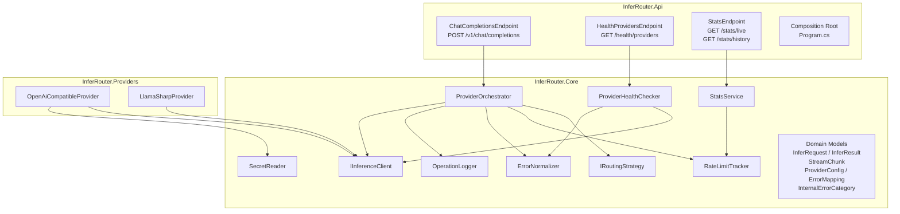

# InferRouter — Architecture

---

## Project Structure

```
InferRouter/
├── src/
│   ├── InferRouter.Core/            ← interfaces, domain models, zero external deps
│   ├── InferRouter.Providers/       ← IInferenceClient implementations
│   └── InferRouter.Api/             ← ASP.NET Core host, endpoints, DI composition
├── docker/
│   └── docker-compose.yml
├── secrets.example/
│   └── provider_api_key.txt
├── docs/
│   ├── architecture.md
│   └── adr/
├── README.md
└── InferRouter.sln
```

**Dependency rule:**

```
InferRouter.Api  →  InferRouter.Providers  →  InferRouter.Core
```

`InferRouter.Core` carries zero NuGet dependencies. `InferRouter.Providers` references LlamaSharp. `InferRouter.Api` owns the composition root and wires everything together.

---

## Layer Overview



---

## InferRouter.Core

### IInferenceClient

```csharp
public interface IInferenceClient
{
    string Name { get; }
    ProviderType Type { get; }
    bool SupportsStreaming { get; }
    Task<InferResult> CompleteAsync(InferRequest request, CancellationToken ct);
    IAsyncEnumerable<StreamChunk> CompleteStreamingAsync(InferRequest request, CancellationToken ct);
}
```

All providers — HTTP-based and local — implement this interface. `ProviderOrchestrator` is never aware of the concrete type. `SupportsStreaming` indicates whether the provider natively streams tokens; providers where it is `false` simulate streaming by splitting a completed response into chunks.

---

### IRoutingStrategy

```csharp
public interface IRoutingStrategy
{
    // Returns ordered cloud providers to attempt. FinalFallback is never included.
    // May return empty list if all cloud providers are exhausted.
    IReadOnlyList<IInferenceClient> GetOrderedProviders();
}
```

Three implementations: `ChainOfResponsibilityStrategy`, `WeightedRoundRobinStrategy`, `LeastUsedStrategy`. Selection is config-driven via `RoutingStrategy` in `appsettings.json`. The `FinalFallback` provider is always held in reserve by `ProviderOrchestrator` — strategies only handle cloud providers.

---

### Domain Models

```csharp
// Inbound request (OpenAI-compatible input, mapped at the endpoint)
public record InferRequest(
    string RequestId,
    IReadOnlyList<ChatMessage> Messages,
    string? Model,           // optional override; provider default used if null
    int? MaxTokens,
    float? Temperature
);

public record ChatMessage(string Role, string Content);

// Outbound result
public record InferResult(
    string RequestId,
    string ProviderName,
    string Model,
    string Content,
    int PromptTokens,
    int CompletionTokens,
    long LatencyMs,
    bool WasFallback
);

// Streaming chunk yielded during a streaming inference call
public record StreamChunk(
    string RequestId,
    string Delta,           // token/content increment; empty string on the final chunk
    bool IsLast,           // true for the final chunk only
    int? PromptTokens,     // only present on IsLast = true
    int? CompletionTokens  // only present on IsLast = true
);

// Error produced by a provider attempt
public record ProviderError(
    string ProviderName,
    InternalErrorCategory Category,
    int? HttpStatus,
    string? RawErrorCode,
    string? Message
);

public enum InternalErrorCategory
{
    RateLimit,
    ModelUnavailable,
    ServerError,
    AuthError,
    UnknownError
}

public enum ProviderType
{
    OpenAiCompatible,
    LocalGguf
}
```

---

### ProviderConfig (config binding model)

```csharp
public class ProviderConfig
{
    public string Name { get; init; } = "";
    public ProviderType Type { get; init; }
    public string? BaseUrl { get; init; }
    public string? Model { get; init; }
    public int DailyRequestLimit { get; init; }   // 0 = no local limit
    public int RequestsPerMinute { get; init; }   // 0 = no local limit
    public string ErrorCodePath { get; init; } = "error.code";
    public List<ErrorMapping> ErrorMappings { get; init; } = [];
    public string? ModelPath { get; init; }       // local_gguf only
}

public class ErrorMapping
{
    public int HttpStatus { get; init; }
    public string? ErrorCode { get; init; }       // optional body field match
    public InternalErrorCategory InternalCategory { get; init; }
}
```

---

### ProviderOrchestrator

The central routing component. Asks `IRoutingStrategy` for the ordered cloud provider list, appends the explicit `FinalFallback`, then attempts each in order. Delegates error categorization to `ErrorNormalizer`, quota tracking to `RateLimitTracker`, and all structured logging to `OperationLogger`.

```csharp
public class ProviderOrchestrator(
    IReadOnlyList<IInferenceClient> providers,    // cloud providers only
    IInferenceClient finalFallback,               // explicit final fallback (local_gguf or openai_compatible)
    IRoutingStrategy routingStrategy,
    IRateLimitTracker rateLimitTracker,
    ErrorNormalizer errorNormalizer,
    OperationLogger operationLogger,
    ILogger<ProviderOrchestrator> logger)
{
    public async Task<InferResult> ExecuteAsync(InferRequest request, CancellationToken ct);
    public async IAsyncEnumerable<StreamChunk> ExecuteStreamingAsync(InferRequest request, CancellationToken ct);
}
```

**Execution flow:**

```
orderedCloud = routingStrategy.GetOrderedProviders()
toAttempt   = orderedCloud + [finalFallback]

foreach provider in toAttempt:
    try:
        result = await provider.CompleteAsync(request, ct)
        rateLimitTracker.RecordRequest(provider.Name)
        log infer_completed
        return result
    catch ProviderException ex:
        category = errorNormalizer.Categorize(ex.HttpStatus, ex.RawErrorCode, ex.Mappings)
        if category == AuthError  → log warning, continue (permanent skip)
        if category == RateLimit  → rateLimitTracker.MarkExhausted(provider.Name)
        if category == ServerError → retry once inline, then continue
        log infer_fallback(reason: category)
    catch HttpRequestException → log warning, continue
    catch Exception            → log warning, continue

log infer_failed
throw InferRouterException("All providers exhausted")
```

---

### RateLimitTracker

```csharp
public class RateLimitTracker : IRateLimitTracker, IDisposable
{
    // Returns true if the provider's daily or per-minute quota is known to be exhausted
    public bool IsExhausted(string providerName);

    // Called on successful dispatch
    public void RecordRequest(string providerName);

    // Called when a provider returns a rate limit error
    public void MarkExhausted(string providerName);

    // Returns current quota stats for a provider
    public ProviderRateLimitStats GetStats(string providerName);

    // Background timer callback — resets daily counters at UTC midnight
    private void ResetDailyCounters();
}
```

Internal state per provider (private nested class):

```csharp
private sealed class ProviderState(int dailyLimit, int rpmLimit)
{
    public int DailyLimit { get; }
    public int RpmLimit { get; }
    public int DailyCount { get; set; }
    public bool HardExhausted { get; set; }   // true after MarkExhausted(); reset at midnight
    public Queue<DateTimeOffset> RpmWindow { get; }
}
```

---

### ErrorNormalizer

```csharp
public class ErrorNormalizer
{
    // Translates a raw HTTP response (status + optional body) to an internal category
    // using the provider's configured ErrorMappings.
    // Resolution order: (HttpStatus + ErrorCode) match first, then HttpStatus alone, then UnknownError.
    public InternalErrorCategory Categorize(
        int httpStatus,
        string? rawErrorCode,
        IReadOnlyList<ErrorMapping> mappings);
}
```

---

### OperationLogger

```csharp
public class OperationLogger(string logDirectory)
{
    public void LogStarted(InferRequest request);
    public void LogCompleted(InferResult result);
    public void LogFallback(string fromProvider, string toProvider, InternalErrorCategory reason, string requestId);
    public void LogFailed(string requestId, string reason);
    public void LogRateLimitHit(string providerName, string requestId);
    public void LogProviderOrdering(string requestId, IReadOnlyList<string> orderedProviders);
    public void LogStreamStarted(string requestId, string providerName);
    public void LogStreamCompleted(string requestId, string providerName, int promptTokens, int completionTokens, long latencyMs);
}
```

Event types written: `infer_started`, `infer_ordering`, `infer_completed`, `infer_fallback`, `infer_failed`, `rate_limit_hit`, `stream_started`, `stream_completed`. Token counts are only available at `stream_completed` time; no per-chunk log entries are written.

All methods append a single JSONL line to `{logDirectory}/operations-{yyyy-MM-dd}.jsonl`. The file is opened in append mode per write — no persistent file handle — to avoid locking issues in a single-instance deployment.

---

### ProviderHealthChecker

```csharp
public class ProviderHealthChecker(
    IReadOnlyList<IInferenceClient> providers,
    ErrorNormalizer errorNormalizer)
{
    // Probes every provider with a minimal 1-token request and returns a health result per provider.
    public async Task<IReadOnlyList<ProviderHealthResult>> CheckAllAsync(CancellationToken ct);
}
```

Results carry `status` (`ok`, `rate_limit`, `auth_error`, `server_error`, `model_unavailable`, `unknown_error`), the raw HTTP status when applicable, and latency in milliseconds.

---

### StatsService

```csharp
public class StatsService(
    IRateLimitTracker rateLimitTracker,
    IReadOnlyList<IInferenceClient> providers,
    string operationLogDirectory)
{
    // Returns current rate limit stats for all providers.
    public IReadOnlyList<ProviderRateLimitStats> GetLiveStats();

    // Returns (found, content) for a specific UTC date's operation log file.
    public (bool found, string? content) GetHistoryForDate(DateOnly date);
}
```

---

### SecretReader

Registered as a singleton in DI. `ILogger<SecretReader>` is injected via primary constructor — no static state, no `Configure` call required.

```csharp
public class SecretReader(ILogger<SecretReader> logger)
{
    // Reads /run/secrets/{providerName}_api_key
    // Returns null and logs a warning if the file does not exist or is empty.
    public string? ReadApiKey(string providerName);
}
```

---

## InferRouter.Providers

### OpenAiCompatibleProvider

```csharp
public class OpenAiCompatibleProvider(
    ProviderConfig config,
    SecretReader secretReader,  // injected; ReadApiKey called fresh on every request
    HttpClient httpClient) : IInferenceClient
{
    public string Name => config.Name;
    public ProviderType Type => ProviderType.OpenAiCompatible;
    public bool SupportsStreaming => true;

    public async Task<InferResult> CompleteAsync(InferRequest request, CancellationToken ct);
    // calls secretReader.ReadApiKey(config.Name) at the start of each request;
    // throws ProviderException(401) if null — no API key is ever stored in a field.
    // throws ProviderException on non-2xx, carrying HttpStatus and raw error body

    public async IAsyncEnumerable<StreamChunk> CompleteStreamingAsync(InferRequest request, CancellationToken ct);
    // sends "stream": true to upstream; parses SSE data: lines and yields StreamChunk per token.
    // data: [DONE] terminates the enumerable.
}
```

Uses `System.Net.Http.HttpClient` with a shared instance per provider. Serializes to/from the OpenAI chat completions request/response shape using `System.Text.Json`.

The per-request key read means Docker Secret rotation is picked up automatically without a container restart.

---

### LlamaSharpProvider

```csharp
public class LlamaSharpProvider(ProviderConfig config) : IInferenceClient
{
    public string Name => config.Name;
    public ProviderType Type => ProviderType.LocalGguf;
    public bool SupportsStreaming => false;

    // Model is loaded lazily on first call to avoid memory cost when cloud providers are healthy
    public async Task<InferResult> CompleteAsync(InferRequest request, CancellationToken ct);

    public async IAsyncEnumerable<StreamChunk> CompleteStreamingAsync(InferRequest request, CancellationToken ct);
    // calls CompleteAsync internally, then splits the completed content into word-boundary chunks
    // and yields them. Callers receive a valid SSE stream; time-to-first-token equals
    // the full inference latency.
}
```

The underlying `LLamaWeights` and `LLamaContext` instances are loaded once and reused. Thread safety is handled by a `SemaphoreSlim(1)` — LlamaSharp contexts are not thread-safe.

---

## InferRouter.Api

### ChatCompletionsEndpoint

```csharp
// Registered in Program.cs as:
// ChatCompletionsEndpoint.Map(app);  →  app.MapPost("/v1/chat/completions", HandleAsync)

public class ChatCompletionsEndpoint
{
    public static void Map(WebApplication app);

    public static async Task<IResult> HandleAsync(
        OpenAiChatRequest openAiRequest,
        ProviderOrchestrator executor,
        ILogger<ChatCompletionsEndpoint> logger,
        HttpContext httpContext,
        CancellationToken ct);
}
```

Responsibility:
- Maps the inbound OpenAI request shape to `InferRequest`
- **Non-streaming** (`stream: false` or absent): calls `ProviderOrchestrator.ExecuteAsync`, maps `InferResult` to OpenAI JSON response. Returns `200 OK` on success, `503` if all providers exhausted, `499` on cancellation, `500` on unexpected error.
- **Streaming** (`stream: true`): sets `Content-Type: text/event-stream`, calls `ProviderOrchestrator.ExecuteStreamingAsync`, and writes each `StreamChunk` as a `data: {...}` SSE frame. Writes `data: [DONE]` after the final chunk. On `InferRouterException`, writes `data: [DONE]` to terminate the stream gracefully.

### HealthProvidersEndpoint

```csharp
// GET /health/providers
public class HealthProvidersEndpoint
{
    public static void Map(WebApplication app);
    public static async Task<IResult> HandleAsync(ProviderHealthChecker checker, CancellationToken ct);
}
```

Probes all configured providers and returns a JSON array of health results. Always returns `200 OK` — provider status is expressed in the response body, not the HTTP status code.

### StatsEndpoint

```csharp
// GET /stats/live
// GET /stats/history?date=yyyy-MM-dd
public class StatsEndpoint
{
    public static void Map(WebApplication app);
    public static IResult HandleLive(StatsService statsService);
    public static IResult HandleHistory(StatsService statsService, string? date = null);
}
```

`/stats/live` returns current rate limit counters for all providers. `/stats/history` returns the raw JSONL content of a day's operation log (today if no `date` param). Returns `404` if the log file does not exist, `400` for an invalid date format.

### OpenAI Wire Models

Separate request/response records that mirror the OpenAI API shape exactly. These are only used at the endpoint boundary and are never passed into Core.

```csharp
public record OpenAiChatRequest(
    string Model,
    List<OpenAiMessage> Messages,
    int? MaxTokens,
    float? Temperature,
    bool? Stream    // null and false both result in non-streaming behaviour
);

public record OpenAiChatResponse(
    string Id,
    string Object,
    long Created,
    string Model,
    List<OpenAiChoice> Choices,
    OpenAiUsage Usage
);
```

---

## Startup Validation (Program.cs)

On startup, before the host starts accepting requests, the following checks run. Steps 1–9 are fatal (non-zero exit on failure). Step 10 emits warnings only.

1. Provider list must contain at least one entry
2. No provider may have an empty `Name`
3. Provider `Name` values must be unique
4. `FinalFallback` section must be present
5. `FinalFallback.Type` must be `LocalGguf` or `OpenAiCompatible`
6. `LocalGguf` is not allowed in the `Providers` array (must be in `FinalFallback` instead)
7. All `OpenAiCompatible` providers in `Providers` must have a non-empty `BaseUrl`
8. If `FinalFallback.Type == OpenAiCompatible`: `BaseUrl` must be non-empty and the server must be reachable at startup (5-second HTTP health check, skipped in `Test` environment)
9. If `FinalFallback.Type == LocalGguf`: `ModelPath` must exist on disk (skipped in `Test` environment)
10. `DailyRequestLimit` and `RequestsPerMinute` must be `>= 0` for all providers
11. Warnings (non-fatal): `WeightedRoundRobin` selected but all cloud providers have `DailyRequestLimit: 0`; unrecognised `RoutingStrategy` value

API key availability is not validated at startup. `SecretReader.ReadApiKey` is called per request inside `OpenAiCompatibleProvider.CompleteAsync`; a missing key produces a `ProviderException(401)` which `ProviderOrchestrator` treats as `AuthError` and skips to the next provider.
