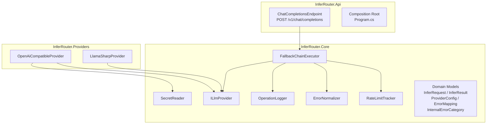

# InferRouter — Architecture

---

## Project Structure

```
InferRouter/
├── src/
│   ├── InferRouter.Core/            ← interfaces, domain models, zero external deps
│   ├── InferRouter.Providers/       ← ILlmProvider implementations
│   └── InferRouter.Api/             ← ASP.NET Core host, endpoint, DI composition
├── docker/
│   └── docker-compose.yml
├── secrets.example/
│   └── provider_api_key.txt
├── docs/
│   ├── architecture.md
│   └── adr/
├── README.md
└── InferRouter.sln
```

**Dependency rule:**

```
InferRouter.Api  →  InferRouter.Providers  →  InferRouter.Core
```

`InferRouter.Core` carries zero NuGet dependencies. `InferRouter.Providers` references LlamaSharp. `InferRouter.Api` owns the composition root and wires everything together.

---

## Layer Overview



---

## InferRouter.Core

### ILlmProvider

```csharp
public interface ILlmProvider
{
    string Name { get; }
    ProviderType Type { get; }
    Task<InferResult> CompleteAsync(InferRequest request, CancellationToken ct);
}
```

All providers — HTTP-based and local — implement this interface. The `FallbackChainExecutor` is never aware of the concrete type.

---

### Domain Models

```csharp
// Inbound request (OpenAI-compatible input, mapped at the endpoint)
public record InferRequest(
    string RequestId,
    IReadOnlyList<ChatMessage> Messages,
    string? Model,           // optional override; provider default used if null
    int? MaxTokens,
    float? Temperature
);

public record ChatMessage(string Role, string Content);

// Outbound result
public record InferResult(
    string RequestId,
    string ProviderName,
    string Model,
    string Content,
    int PromptTokens,
    int CompletionTokens,
    long LatencyMs,
    bool WasFallback
);

// Error produced by a provider attempt
public record ProviderError(
    string ProviderName,
    InternalErrorCategory Category,
    int? HttpStatus,
    string? RawErrorCode,
    string? Message
);

public enum InternalErrorCategory
{
    RateLimit,
    ModelUnavailable,
    ServerError,
    AuthError,
    UnknownError
}

public enum ProviderType
{
    OpenAiCompatible,
    LocalGguf
}
```

---

### ProviderConfig (config binding model)

```csharp
public class ProviderConfig
{
    public string Name { get; init; } = "";
    public ProviderType Type { get; init; }
    public string? BaseUrl { get; init; }
    public string? Model { get; init; }
    public int DailyRequestLimit { get; init; }   // 0 = no local limit
    public int RequestsPerMinute { get; init; }   // 0 = no local limit
    public string ErrorCodePath { get; init; } = "error.code";
    public List<ErrorMapping> ErrorMappings { get; init; } = [];
    public string? ModelPath { get; init; }       // local_gguf only
}

public class ErrorMapping
{
    public int HttpStatus { get; init; }
    public string? ErrorCode { get; init; }       // optional body field match
    public InternalErrorCategory InternalCategory { get; init; }
}
```

---

### FallbackChainExecutor

The central routing component. Iterates the provider list, delegates error categorization to `ErrorNormalizer`, quota checks to `RateLimitTracker`, and all logging to `OperationLogger`.

```csharp
public class FallbackChainExecutor(
    IReadOnlyList<ILlmProvider> providers,
    RateLimitTracker rateLimitTracker,
    ErrorNormalizer errorNormalizer,
    OperationLogger logger)
{
    public async Task<InferResult> ExecuteAsync(InferRequest request, CancellationToken ct);
}
```

**Execution flow:**

```
foreach provider in chain:
    if RateLimitTracker.IsExhausted(provider)  → log rate_limit_hit, continue
    try:
        result = await provider.CompleteAsync(request, ct)
        log infer_completed
        return result
    catch ProviderException ex:
        category = ErrorNormalizer.Categorize(ex, provider.Config)
        log infer_fallback(reason: category)
        if category == AuthError → do not retry, continue (permanent skip)
        if category == ServerError → retry once, then continue
        continue

log infer_failed
throw InferRouterException("All providers exhausted")
```

---

### RateLimitTracker

```csharp
public class RateLimitTracker
{
    // Returns true if the provider's daily or per-minute quota is known to be exhausted
    public bool IsExhausted(string providerName);

    // Called on successful dispatch
    public void RecordRequest(string providerName);

    // Called when a provider returns a rate limit error
    public void MarkExhausted(string providerName);

    // Background timer callback — resets daily counters at UTC midnight
    private void ResetDailyCounters();
}
```

Internal state per provider:

```csharp
private record ProviderQuota(
    int DailyLimit,
    int RpmLimit,
    int DailyCount,
    bool HardExhausted,         // true after MarkExhausted() — stays until midnight reset
    Queue<DateTimeOffset> RpmWindow
);
```

---

### ErrorNormalizer

```csharp
public class ErrorNormalizer
{
    // Translates a raw HTTP response (status + optional body) to an internal category
    // using the provider's configured ErrorMappings.
    // Resolution order: (HttpStatus + ErrorCode) match first, then HttpStatus alone, then UnknownError.
    public InternalErrorCategory Categorize(
        int httpStatus,
        string? rawErrorCode,
        IReadOnlyList<ErrorMapping> mappings);
}
```

---

### OperationLogger

```csharp
public class OperationLogger(string logFilePath)
{
    public void LogStarted(InferRequest request);
    public void LogCompleted(InferResult result);
    public void LogFallback(string fromProvider, string toProvider, InternalErrorCategory reason, string requestId);
    public void LogFailed(string requestId, string reason);
    public void LogRateLimitHit(string providerName, string requestId);
}
```

All methods append a single JSONL line. The file is opened in append mode per write — no persistent file handle — to avoid locking issues in a single-instance deployment.

---

### SecretReader

Registered as a singleton in DI. `ILogger<SecretReader>` is injected via primary constructor — no static state, no `Configure` call required.

```csharp
public class SecretReader(ILogger<SecretReader> logger)
{
    // Reads /run/secrets/{providerName}_api_key
    // Returns null and logs a warning if the file does not exist or is empty.
    public string? ReadApiKey(string providerName);
}
```

---

## InferRouter.Providers

### OpenAiCompatibleProvider

```csharp
public class OpenAiCompatibleProvider(
    ProviderConfig config,
    SecretReader secretReader,  // injected; ReadApiKey called fresh on every request
    HttpClient httpClient) : ILlmProvider
{
    public string Name => config.Name;
    public ProviderType Type => ProviderType.OpenAiCompatible;

    public async Task<InferResult> CompleteAsync(InferRequest request, CancellationToken ct);
    // calls secretReader.ReadApiKey(config.Name) at the start of each request;
    // throws ProviderException(401) if null — no API key is ever stored in a field.
    // throws ProviderException on non-2xx, carrying HttpStatus and raw error body
}
```

Uses `System.Net.Http.HttpClient` with a shared instance per provider. Serializes to/from the OpenAI chat completions request/response shape using `System.Text.Json`.

The per-request key read means Docker Secret rotation is picked up automatically without a container restart.

---

### LlamaSharpProvider

```csharp
public class LlamaSharpProvider(ProviderConfig config) : ILlmProvider
{
    public string Name => config.Name;
    public ProviderType Type => ProviderType.LocalGguf;

    // Model is loaded lazily on first call to avoid memory cost when cloud providers are healthy
    public async Task<InferResult> CompleteAsync(InferRequest request, CancellationToken ct);
}
```

The underlying `LLamaWeights` and `LLamaContext` instances are loaded once and reused. Thread safety is handled by a `SemaphoreSlim(1)` — LlamaSharp contexts are not thread-safe.

---

## InferRouter.Api

### ChatCompletionsEndpoint

```csharp
// Registered in Program.cs as:
// app.MapPost("/v1/chat/completions", ChatCompletionsEndpoint.HandleAsync);

public static class ChatCompletionsEndpoint
{
    public static async Task<IResult> HandleAsync(
        OpenAiChatRequest openAiRequest,
        FallbackChainExecutor executor,
        CancellationToken ct);
}
```

Responsibility:
- Maps the inbound OpenAI request shape to `InferRequest`
- Calls `FallbackChainExecutor.ExecuteAsync`
- Maps `InferResult` back to the OpenAI response shape
- Returns `200 OK` with the response, or `503` if all providers are exhausted

### OpenAI Wire Models

Separate request/response records that mirror the OpenAI API shape exactly. These are only used at the endpoint boundary and are never passed into Core.

```csharp
public record OpenAiChatRequest(
    string Model,
    List<OpenAiMessage> Messages,
    int? MaxTokens,
    float? Temperature
);

public record OpenAiChatResponse(
    string Id,
    string Object,
    long Created,
    string Model,
    List<OpenAiChoice> Choices,
    OpenAiUsage Usage
);
```

---

## Startup Validation (Program.cs)

On startup, before the host starts accepting requests:

1. Read provider list from `appsettings.json`
2. Validate that at least one provider is defined
3. Validate that the last provider is `local_gguf`
4. Validate that all `openai_compatible` entries have a `BaseUrl`
5. Validate that the `local_gguf` entry has a `ModelPath` that exists on disk
6. Build the `ILlmProvider` list and register `FallbackChainExecutor` in DI

If steps 2–5 fail, the application exits with a non-zero code and a descriptive error message.

API key availability is not validated at startup. `SecretReader.ReadApiKey` is called per request inside `OpenAiCompatibleProvider.CompleteAsync`; a missing key produces a `ProviderException(401)` which the `FallbackChainExecutor` treats as `AuthError` and skips to the next provider.
